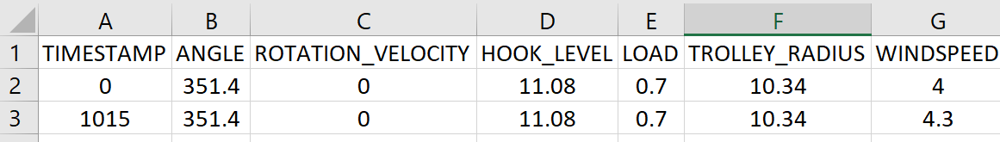

# CSV-MQTT for Digital Twin
This repositry was forked from https://github.com/schaffung/CSV-MQTT and modified

## Introduction
This code was a part of my Design Driven Project at the construction robotic master program at the RWTH Aachen university. 

Since I wasn’t able to get real data from real sources for my Digital Twin I must make an artificial tool as an alternative for the real device. 

This tool can be very helpful for students who want to test a digital twin prototype on their own without having connection to the real device. 

## Tool description
A CSV to MQTT connector. Reads data from csv file and pushes it to a MQTT Broker.

when working in internet of things many a times we don’t have a direct connection to the real device and we want an alternative to read a particular .csv file and then form a MQTT payload to publish it to a broker.
The idea is simple. The process will read the .csv file wherein the very first row contains the columns headers. ( Please add column headers before using the code or be ready to see something strange.) Then the same column headers are treated as Keys and the corresponding row values as Values in a JSON object while forming a MQTT Payload.
In the case that the csv file has a “timestamp” column the code will remove it and use its content as time interval for the publishing. 

## How to Install the tool
### first way

You can install the original package using pip

```
pip3 install csv-mqtt
```
Than clone this repository and copy the content of the csv_mqtt folder in it in the original package.

NOTE: you can find the orginal package folder in the following path
```
C:\Users\USERNAME\AppData\Local\Packages\PythonSoftwareFoundation.Python.3.9_qbz5n2kfra8p0\LocalCache\local-packages\Python39\site-packages\csv_mqtt
```
don't forget to install the pandas library using pip
### secound way
clone this repository and install the package manually using pip
1. open a command or terminal window
2. cd into the root directory where setup.py is located 
3. Enter: python setup.py install

## How to use the tool
For example, If the .csv has column headers as,TIMESTAMP, ANGLE, ROTATION_VELOCITY, HOOK_LEVEL, LOAD, TROLLEY_RADIUS and WINDSPEED

As shown in the photo



Then the resulting MQTT Payload will be of the form,

```javascript
{
  "ANGLE" : "351.4",
  "ROTATION_VELOCITY" : "0",
  "HOOK_LEVEL" : "11.08"
  "LOAD" : "0.7"
  "TROLLEY_RADIUS" : "10.34"
  "WINDSPEED" : "4"
}
```
for the first line!

### CSV_MQTT publicher:
you can find an example in the example folder under publisher.py

1. import the paho library
2. copy and past the path of the csv file instat of "./example/sample.csv"
3. add the broker address to the CsvMqtt method

   ```python
   CsvMqtt(self, broker, port=1883, timeout=60, connect_cb=on_connect, publish_cb=on_publish)
   ```
   NOTE: following broker can be used
   - mqtt.eclipse.org
   - test.mosquitto.org
   - broker.hivemq.com
   - mqtt.flespi.io
   - mqtt.dioty.co
   - mqtt.fluux.io
   - broker.emqx.io
4. fulfill the arguments of the function "publish_csv_data" by adding the CSV file path and a topic name 
   ```python
   publish_csv_data(self, csv_path, mqtt_topic, interval=5, col_list = ["TIMESTAMP"])
   ```
5. you are ready to publish :D

### MQTT Subscriber:
you can find an example in the example folder under client.py

1. import the paho library
2. change the topic name ("Topic_example") to your topic name 

   ```python
   def on_connect(client, userdata, flags, rc):
    client.subscribe("Topic_example")
   ```
3. change the broker data to your selected broker

   ```python
   if __name__ == "__main__":
    client = mqtt.Client()
    client.connect("broker.hivemq.com", 1883, 60)
   ```
4. you can select diffrent loops to recieve messages

    NOTE: in the following link the diffrent kinds of loop used in paho library is described.

    http://www.steves-internet-guide.com/loop-python-mqtt-client/#:~:text=The%20loop()%20function%20is,See%20Understanding%20callbacks.

5. you are ready to receive messages from the broker!

## Credits
the credit goes to the developer of the code mr `srijan sivakumar` with the following github account:
https://github.com/schaffung

Also to mr `Steve Cope` who explains using MQTT on his website: http://www.steves-internet-guide.com/

## License
Licensed unter the [MIT License](LICENSE)


